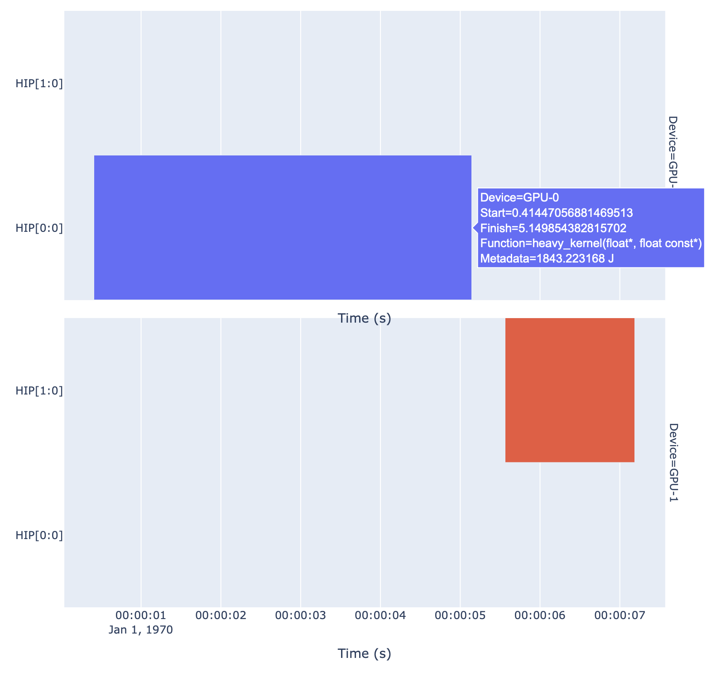
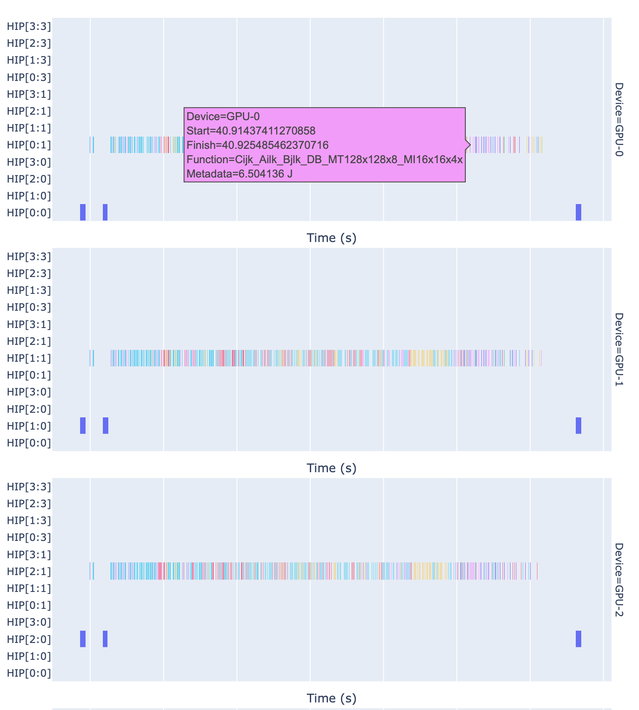

# hpc-energy-trace-analysis

This repository contains code for analyzing ScoreP traces containing energy consumption information.
It primarily focuses on attributing energy consumption to specific MPI ranks, GPU devices on those ranks, and the GPU kernels executed on those devices.

# Requirements

|**Package**|**Version**|
|---|---|
|Python|`3.8+`|
|[`otf2`](https://perftools.pages.jsc.fz-juelich.de/cicd/otf2/tags/latest/python/index.html)|`3.1.1+`|
|[`pandas`](https://pandas.pydata.org)|`1.5.3+`|
|[`plotly`](https://plotly.com/python/)|`5.9.0+`|

These packages can be installed using `pip` and the provided `requirements.txt` file:

```bash
pip install -r requirements.txt
```

# Usage

First, use [`scorep-amd`](https://github.com/adam-mcdaniel/scorep-amd) to generate a ScoreP trace with energy consumption information. **The base PAPI plugins for ScoreP do not collect energy consumption data, so you must use the patched plugins provided by the `scorep-amd` repository.**

Your generated trace should have the following structure:

```sh
experiment-results/
├── traces.otf2           # The anchor file for the ScoreP trace
├── traces.def            # The definition file for the ScoreP trace
├── scorep.cfg            # The environment configuration file for ScoreP
└── traces/               # Directory containing the thread specific events and definitions
```

Then, edit the `analyze_timeline...` scripts to point to the `traces.otf` file. You will also need to specify which threads correspond to which energy consuming devices (e.g., GPUs), and the metrics that correspond to those devices. The scripts will then generate a timeline of energy consumption attributed to the specified devices and their associated GPU kernels.

# Example

### Single Node Analysis

Here's some sample output of the single node analysis script, which generates a timeline of energy consumption attributed to the GPU devices and their associated GPU kernels on a single node:

```bash
$ python3 analyze_timeline_single_node.py
Device: GPU-0
   Max Recorded Sample for GPU-0: 2237.380365 J
   1843.223168 J, heavy_kernel(float*, float con, 4.735383814001007s
   Total Attributed Metrics for GPU-0:
      1843.223168 J, Metric: A2rocm_smi:::energy_count:device=0
   Idle attribution for GPU-0: 394.157197 J
Device: GPU-1
   Max Recorded Sample for GPU-1: 1874.190017 J
   1119.611771 J, light_kernel(float*, float con, 1.6283328474139287s
   Total Attributed Metrics for GPU-1:
      1119.611771 J, Metric: A2rocm_smi:::energy_count:device=1
   Idle attribution for GPU-1: 754.578246 J
```

And the accompanying timeline plot will show the energy consumption attributed to each GPU device and their associated kernels over time:



The `Metadata` field for each event in the timeline contains the energy consumption attributed to that event in units of Joules.

### Multi Node Analysis

The multi-node analysis script works similarly, but it generates separate timelines and energy attributions for each node in the experiment.




# Contributing

Contributions are welcome! If you have suggestions for improvements or find bugs, please open an issue or submit a pull request.

# License

This project is licensed under the MIT License. See the [LICENSE](LICENSE) file for details.
